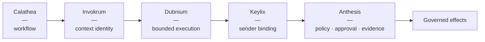

<h1 align="center">RJ</h1>

  <strong>Senior / Staff / Principal Software Engineer</strong> 
  Secure systems · Agentic AI infrastructure · Platform engineering · Mobile

  <a href="https://micrantha.com">micrantha.com</a> ·
  <a href="https://ryanjennin.gs">ryanjennin.gs</a> ·
  <a href="mailto:rybertjen@gmail.com">email</a>

---

I build long-lived software systems where **correctness, security, operability, and explicit trust boundaries** matter.

My background spans 15+ years across Android, iOS, React Native, Kotlin Multiplatform, backend systems, cloud/platform engineering, infrastructure, and application security. I still work across the stack, but my current focus is the intersection of **agentic AI, secure software delivery, platform engineering, and governance**.

The recurring question behind much of my current work is:

> How do autonomous systems become more capable without quietly accumulating unchecked authority?

## Current focus

- **Governed agentic systems** — policy, capabilities, approvals, evidence, provenance, replay, and bounded side effects.
- **AI-native SDLC** — treating agents as constrained delivery participants rather than trusted autocomplete or autonomous maintainers.
- **Context integrity** — deterministic prompt/context composition, manifests, lockfiles, provenance, and reproducible agent inputs.
- **Agent identity & authorization** — sender-constrained OAuth, proof-of-possession, replay resistance, and MCP security boundaries.
- **Local-first AI infrastructure** — model routing, supervisor/specialist agents, memory, evaluation, scheduling, and secure execution on self-hosted infrastructure.
- **Platform & developer experience** — paved paths, strong contracts, predictable failure modes, observability, CI/CD, and incremental modernization.

A principle I keep returning to: **a system may propose its successor, but it should not independently authorize the transition to that successor.** Durable state changes need an external trust boundary and evidence that can be independently evaluated.

## Micrantha / governed agent stack

A set of deliberately separated projects exploring those boundaries:

| Project | Role |
| --- | --- |
| **[Anthesis](https://anthesis.micrantha.com)** | Deterministic governance boundary for consequential agentic effects: policy, approval, capabilities, evidence, provenance, and auditability. |
| **[Invokrum](https://github.com/hackelia-micrantha/invokrum)** | Deterministic prompt-overlay composition and attestation: explicit ordering, compatibility, manifests, lockfiles, and reproducible context. |
| **[Keylix](https://github.com/hackelia-micrantha/keylix)** | Sender-constrained authorization and proof-of-possession primitives for OAuth, DPoP, MCP, and agentic workloads. |
| **Dubnium** | Private local-first AI/runtime test bed: supervisor/specialists, model routing, memory, tools, scheduling, runtime evidence, and governed execution. |
| **Calathea** | Workflow/task-contract layer for composing bounded agent work without collapsing orchestration into governance or runtime concerns. |

The goal is not a monolithic agent framework. The interesting work is at the **boundaries**: what context entered the system, who or what is acting, what authority it has, what effect is requested, who approves it, and what evidence remains afterward.

## Selected public work

- **[Anthesis Governance Lab](https://github.com/ryjen/anthesis-governance-lab)** — public conformance and demonstration surface for deterministic agent-governance contracts.
- **[Secure Agent Workflows](https://github.com/ryjen/agent-delivery-playbook)** — practical patterns, threat models, task contracts, and evidence expectations for secure AI-assisted software delivery.
- **[Eyespie](https://github.com/ryjen/eyespie)** — Kotlin Multiplatform / mobile computer-vision work, including iOS and MediaPipe integration.
- **[Guitar Practice System](https://github.com/ryjen/guitar-practice-system)** — structured practice tooling exploring progression, assessment, backing tracks, and AI-assisted music workflows.
- **[git-autocommit](https://github.com/ryjen/git-autocommit)** and other small tools — experiments in developer workflow automation, repository safety, and bounded automation.

There is also a fair amount of older code here. I started programming in 1998 and publishing open-source software before GitHub existed; not every repository represents my current engineering style or priorities. The projects above are the useful signal.

## Engineering perspective

I tend to work best on systems that are already real enough to have constraints:

- production software with users, migrations, compatibility requirements, and operational history;
- security-sensitive authentication, authorization, credential, and trust boundaries;
- platform or developer-experience work that must improve delivery without creating a second platform nobody wants to maintain;
- mobile systems where platform-specific behavior matters and cannot always be abstracted into "just another web client";
- agentic/AI systems where probabilistic reasoning needs deterministic controls around consequential effects.

I prefer incremental modernization over rewrites, explicit contracts over convention, boring cryptography over clever cryptography, and evidence over claims that a system "should" be safe.

## Current goals

I am continuing to turn the Micrantha work into **small, composable, auditable systems and public reference material** for secure agentic software delivery.

Professionally, I am interested in **Staff / Principal engineering and selective contract work** around AI infrastructure, platform engineering, application security, developer experience, secure SDLC, and complex mobile/backend systems — preferably remote-first in Canada.

I am also interested in collaborating on work around:

- agent governance, authorization, observability, and evaluation;
- MCP and agent/tool security;
- secure platform and API design;
- mobile security and device/app trust;
- local/self-hosted AI infrastructure;
- practical research-to-production engineering.

## Outside software

I play guitar and piano, record music, play hockey, and occasionally turn engineering energy toward things that have nothing to do with infrastructure — including **[The Fatherless](https://fatherless.ryanjennin.gs)**, a long-form fiction/screenplay project.

he / him
